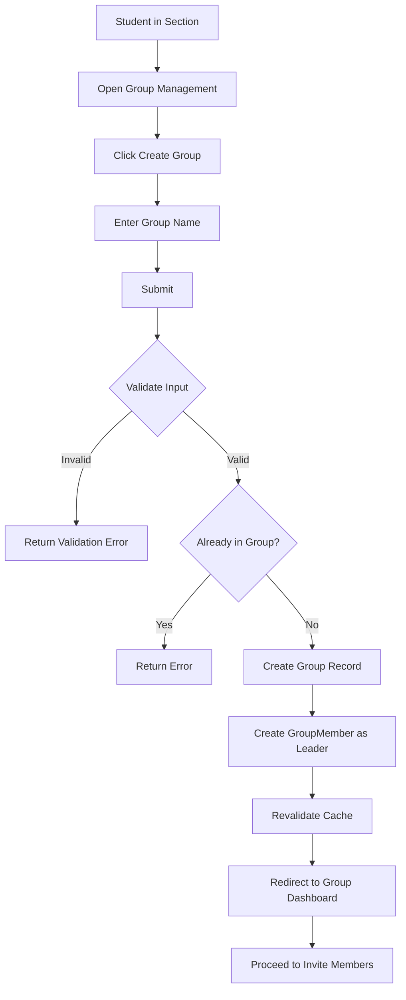

# Group Creation Data Flow

## Purpose

This document describes how a student creates a capstone group within a class section and becomes the Group Leader.

---

# Actors

- Student (Group Leader)

---

# Related Models

See the Prisma schema for the complete model definitions.

**Reference**

```text
prisma/schema.prisma

Models:
- Student
- Section
- Group
- GroupMember
```

---

# Business Rules

- Only authenticated students with a section may create a group.
- A student may only belong to one group at a time.
- The student who creates the group becomes the Group Leader.
- A unique group name is required.

---

# Data Flow



---

# Request Payload

## createGroup()

```ts
{
    groupName: "Capstone Group A"
}
```

---

# Database Operations

Creates one Group record.

Creates one GroupMember record with role LEADER for the creator.

```text
Student ──> GroupMember ──> Group
```

---

# Queries

## getGroup(studentId)

### Signature

```ts
async (studentId: number)
    => Group | null
```

Returns the group the student belongs to, if any. Used to check group membership before creation.

Cache

```ts
cacheTag(`group-student-${studentId}`)
```

---

# Mutations

## createGroup()

### Signature

```ts
async (_prevState, formData)
```

Steps

1. Validate input.
2. Check student is not already in a group.
3. Create Group record.
4. Create GroupMember record with role LEADER.
5. Revalidate cache.
6. Return success.

Cache

```ts
revalidateTag('groups')
revalidateTag(`group-student-${studentId}`)
```

---

# Validation Rules

| Part | Field | Rule |
|------|--------|------|
| A | groupName | Required |
| A | groupName | Max 100 characters |
| A | Student | Must belong to a section |
| A | Student | Must not already be in a group |

---

# Cache Strategy

| Function | Cache |
|----------|-------|
| getGroup() | group-student-{studentId} |
| createGroup() | groups, group-student-{studentId} |

---

# Error Handling

| Scenario | Result |
|----------|--------|
| Invalid group name | Validation error |
| Already in a group | Conflict |
| Not a member of any section | Precondition failed |

---

# Postconditions

- Group record exists with a unique group name.
- GroupMember record exists with role LEADER for the creator.

---

# Next Data Flows

- Join Group (invite members, respond to invitations)
- Adviser Assignment
- Capstone 1 Submission
- Progress Monitoring
