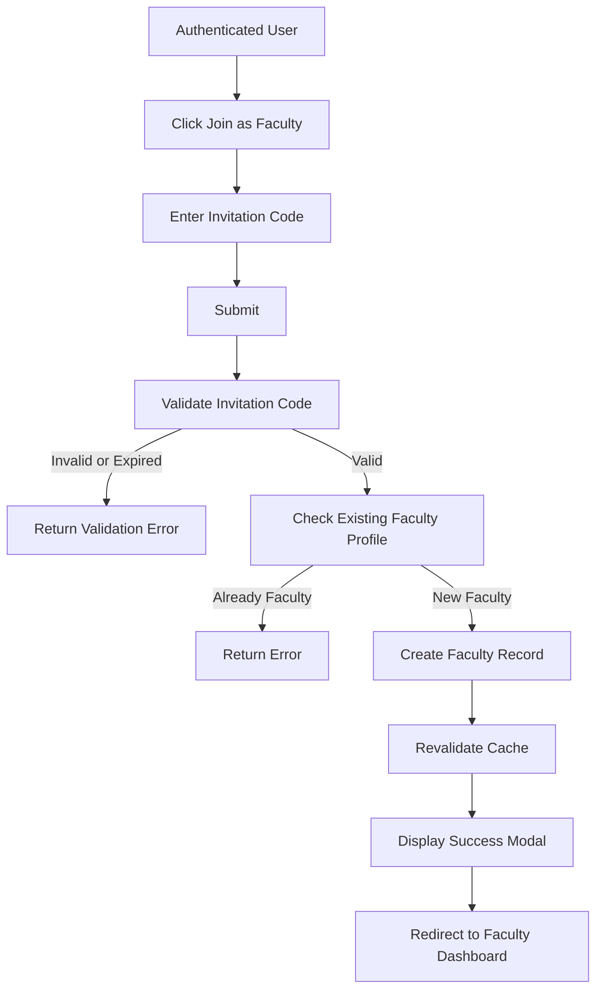

# Faculty Join Data Flow

## Purpose

This document describes how an authenticated user joins the faculty using the invitation code generated by the Program Chair.

Successfully joining automatically creates the Faculty profile and links it to the user's account.

---

## Program Chair Workflow

The Program Chair manages a single reusable invitation code for faculty onboarding:

1. Program Chair opens the faculty invite page.
2. The system checks for an existing `InvitationCode`:
   - **Code exists and is not expired** → display the current code for copying.
   - **Code is expired or does not exist** → generate a new `InvitationCode` and display it.
3. Program Chair copies the code and shares it with prospective faculty.

---

# Actors

- User
- Faculty
- Program Chair

---

# Related Models

See the Prisma schema for the complete model definitions.

**Reference**

```text
prisma/schema.prisma

Models:
- User
- Faculty
- InvitationCode
```

---

# Business Rules

- Only authenticated users may join as faculty.
- The invitation code must exist.
- Invitation codes are managed by Program Chairs.
- Invitation codes expire after a set duration.
- Invitation codes are reusable before they expire.
- A user may only become a Faculty once.
- Joining as faculty automatically creates the Faculty profile.

---

# Data Flow



---

# Request Payload

```ts
{
    inviteCode: "FAC-8K2PQ-XYZ"
}
```

---

# Database Operations

Creates one Faculty record.

Links the Faculty to the authenticated User.

```text
InvitationCode
       │
       ▼
    Faculty
       ▲
       │
     User
```

---

# Queries

## getInvitationCode()

### Signature

```ts
async (code: string)
    => InvitationCode | null
```

Cache

None.

---

## getFaculty(userId)

### Signature

```ts
async (userId: number)
    => Faculty | null
```

Cache

```ts
cacheTag(`faculty-${userId}`)
```

---

# Mutations

## joinFaculty()

### Signature

```ts
async (_prevState, formData)
```

Steps

1. Validate invitation code.
2. Find InvitationCode.
3. Check existing Faculty profile.
4. Create Faculty record.
5. Connect Faculty to User.
6. Revalidate cache.
7. Return success.

Cache

```ts
revalidateTag('faculty')
revalidateTag(`faculty-${userId}`)
```

---

# Validation Rules

| Field | Rule |
|--------|------|
| inviteCode | Required |
| inviteCode | Must exist |
| inviteCode | Must not be expired |
| User | Must not already be a Faculty |

---

# Cache Strategy

| Function | Cache |
|----------|-------|
| getFaculty() | faculty-{userId} |
| joinFaculty() | faculty, faculty-{userId} |

---

# Error Handling

| Scenario | Result |
|----------|--------|
| Invalid invitation code | Validation error |
| Expired invitation code | Validation error |
| Already a Faculty | Conflict |
| Database error | Server error |
| Unauthenticated user | 401 |

---

# Postconditions

- Faculty profile is created.
- Faculty is linked to the authenticated User.
- User gains access to faculty features.

---

# Next Data Flows

- Coordinator Role Assignment
- Adviser Role Assignment
