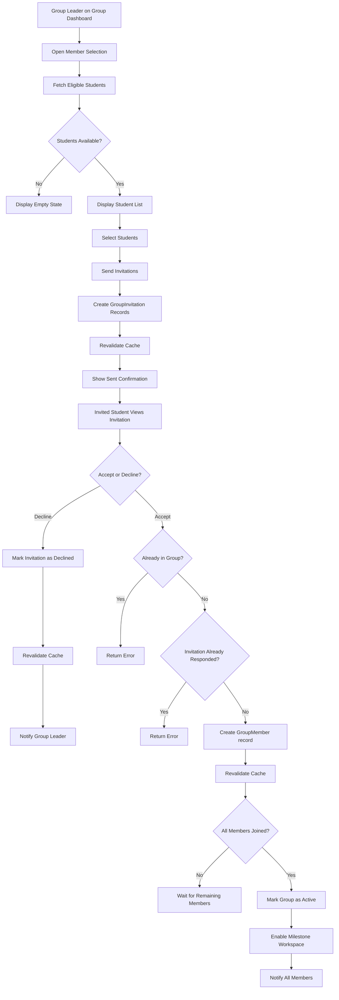

# Join Group Data Flow

## Purpose

This document describes how a Group Leader invites other students from the same class section to join their capstone group, how invited students respond, and how the group becomes active once all members have joined.

---

# Actors

- Student (Group Leader)
- Student (Group Member)

---

# Related Models

See the Prisma schema for the complete model definitions.

**Reference**

```text
prisma/schema.prisma

Models:
- Student
- Section
- Group
- GroupMember
- GroupInvitation
```

---

# Business Rules

- Only students from the same section may be invited.
- A student may only belong to one group at a time.
- Group invitations may be accepted or declined.
- Duplicate invitations from the same group to the same student are prevented.
- Only the Group Leader may invite members.
- An invitation can only be responded to once.
- A group becomes active when all intended members have joined.

---

# Data Flow



---

# Request Payload

## inviteMembers()

```ts
{
    groupId: 1,
    studentIds: [3, 5, 7]
}
```

## respondToInvitation()

```ts
{
    invitationId: 1,
    action: "ACCEPT" | "DECLINE"
}
```

---

# Database Operations

Creates one GroupInvitation record per invited student.

On accept, creates one GroupMember record with role MEMBER.

On decline, updates GroupInvitation status to DECLINED.

Once all members joined, updates Group status to active.

```text
Group ──> GroupInvitation ──> Student
Group ──> GroupMember ──> Student
```

---

# Queries

## getGroup(studentId)

### Signature

```ts
async (studentId: number)
    => Group | null
```

Returns the group the student belongs to, if any. Used to check eligibility.

Cache

```ts
cacheTag(`group-student-${studentId}`)
```

---

## getEligibleStudents(sectionId, groupId)

### Signature

```ts
async (sectionId: number, groupId: number)
    => Student[]
```

Returns students in the same section who are not already in a group and have no pending invitation from this group.

Cache

```ts
cacheTag(`eligible-${sectionId}-${groupId}`)
```

---

## getPendingInvitations(studentId)

### Signature

```ts
async (studentId: number)
    => GroupInvitation[]
```

Returns all pending group invitations for a student.

Cache

```ts
cacheTag(`invitations-${studentId}`)
```

---

## getInvitation(id)

### Signature

```ts
async (id: number)
    => GroupInvitation | null
```

Returns a specific invitation by ID. Used to validate before responding.

Cache

```ts
cacheTag(`invitation-${id}`)
```

---

# Mutations

## inviteMembers()

### Signature

```ts
async (_prevState, formData)
```

Steps

1. Validate group ownership (caller must be the Group Leader).
2. Validate each student belongs to the same section.
3. Check no student is already in a group.
4. Check no duplicate pending or accepted invitations exist.
5. Create GroupInvitation records with status PENDING.
6. Revalidate cache.
7. Return success.

Cache

```ts
revalidateTag(`eligible-${sectionId}-${groupId}`)
revalidateTag(`invitations-${studentId}`)
```

---

## respondToInvitation()

### Signature

```ts
async (_prevState, formData)
```

Steps

1. Validate invitation exists and is PENDING.
2. If ACCEPT:
   - Check student is not already in a group.
   - Check invitation was not already responded to.
   - Create GroupMember record with role MEMBER.
   - If all members joined, mark Group as active.
3. If DECLINE:
   - Mark invitation as DECLINED.
4. Revalidate cache.
5. Return success.

Cache

```ts
revalidateTag(`group-student-${studentId}`)
revalidateTag(`eligible-${sectionId}-${groupId}`)
revalidateTag(`invitations-${studentId}`)
revalidateTag(`group-${groupId}`)
```

---

# Validation Rules

| Part | Field | Rule |
|------|--------|------|
| B | groupId | Must exist |
| B | studentIds | Must be array of integers |
| B | studentIds | Each must be in the same section |
| B | studentIds | Each must not already be in a group |
| B | studentIds | Must not have duplicate pending or accepted invitation |
| C | invitationId | Must exist |
| C | invitationId | Must be PENDING |
| C | action | Must be ACCEPT or DECLINE |

---

# Cache Strategy

| Function | Cache |
|----------|-------|
| getGroup() | group-student-{studentId} |
| getEligibleStudents() | eligible-{sectionId}-{groupId} |
| getPendingInvitations() | invitations-{studentId} |
| getInvitation() | invitation-{id} |
| inviteMembers() | eligible-{sectionId}-{groupId}, invitations-{studentId} |
| respondToInvitation() | group-student-{studentId}, eligible-{sectionId}-{groupId}, invitations-{studentId}, group-{groupId} |

---

# Error Handling

| Scenario | Result |
|----------|--------|
| Not the Group Leader | Unauthorized |
| Invited student already in a group | Conflict |
| No eligible students | Empty state |
| Duplicate pending invitation | Conflict |
| Invitation not found | Not found |
| Invitation already responded to | Conflict |
| Action is invalid | Validation error |

---

# Postconditions

- Invited students receive GroupInvitation records with status PENDING.
- Accepted members are added as GroupMember records with role MEMBER.
- Declined invitations are marked as DECLINED and cannot be re-responded.
- Once all members joined, Group becomes active.
- Milestone workspace is enabled for active Groups.

---

# Next Data Flows

- Adviser Assignment
- Capstone 1 Submission
- Progress Monitoring
