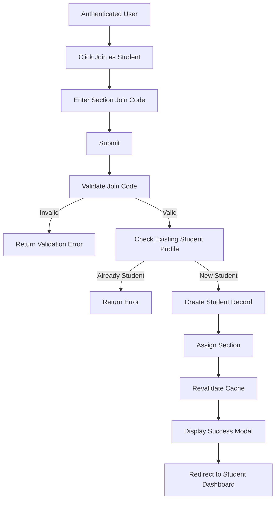

# Student Join Section Data Flow

## Purpose

This document describes how an authenticated user joins a capstone section using the section join code generated by the assigned Coordinator.

Successfully joining a section automatically creates the student's profile and associates it with the selected section.

---

# Actors

- User
- Student
- Coordinator

---

# Related Models

See the Prisma schema for the complete model definitions.

**Reference**

```text
prisma/schema.prisma

Models:
- User
- Student
- Section
- InvitationCode
```

---

# Business Rules

- Only authenticated users may join a section.
- The join code must exist.
- Join codes are stored as InvitationCode records when a Coordinator creates a section.
- Join codes do not expire.
- Multiple students may use the same join code.
- A user may only become a Student once.
- A student may only belong to one section.
- Joining a section automatically creates the Student profile.

---

# Data Flow



---

# Request Payload

```ts
{
    joinCode: "BSIS4AG1-K82PQ"
}
```

---

# Database Operations

Creates one Student record.

Associates the Student with the corresponding Section.

```text
Section
      │
      ▼
Student
      ▲
      │
User
```

---

# Queries

## getSectionByCode()

### Signature

```ts
async (code: string)
    => Section | null
```

Looks up the InvitationCode by code, then returns the associated Section via the `section` relation.

Cache

None.

---

## getStudent(userId)

### Signature

```ts
async (userId: number)
    => Student | null
```

Cache

```ts
cacheTag(`student-${userId}`)
```

---

# Mutations

## joinSection()

### Signature

```ts
async (_prevState, formData)
```

Steps

1. Validate join code.
2. Find Section.
3. Check Student profile.
4. Create Student.
5. Connect Student to Section.
6. Revalidate cache.
7. Return success.

Cache

```ts
revalidateTag('students')
revalidateTag(`student-${userId}`)
revalidateTag(`section-${sectionId}`)
```

---

# Validation Rules

| Field | Rule |
|--------|------|
| joinCode | Required |
| joinCode | Must exist |
| User | Must not already be a Student |

---

# Cache Strategy

| Function | Cache |
|----------|-------|
| getStudent() | student-{userId} |
| joinSection() | students, student-{userId}, section-{sectionId} |

---

# Error Handling

| Scenario | Result |
|----------|--------|
| Invalid join code | Validation error |
| Already a Student | Conflict |
| Database error | Server error |
| Unauthenticated user | 401 |

---

# Postconditions

- Student profile is created.
- Student is assigned to a Section.
- Student gains access to student features.
- Student may proceed to group creation.

---

# Next Data Flows

- Group Creation
- Topic Submission