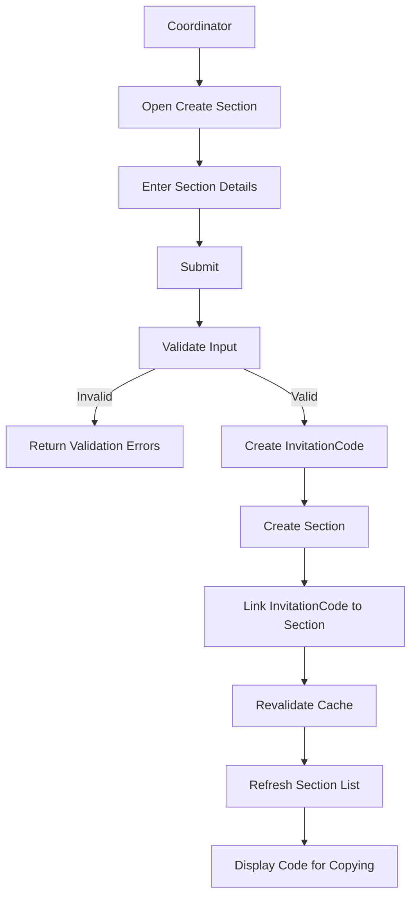

# Section Creation Data Flow

## Purpose

This document describes how a Coordinator creates a capstone section and generates a reusable join code for students.

---

# Actors

- Coordinator

---

# Related Models

See the Prisma schema for the complete model definitions.

**Reference**

```text
prisma/schema.prisma

Models:
- Coordinator
- Section
- InvitationCode
```

---

# Business Rules

- Only Coordinators may create sections.
- Every Section has one InvitationCode with a unique code.
- InvitationCodes are automatically generated.
- InvitationCodes have an expiration (set far-future for sections).
- InvitationCodes may be used by multiple students.
- One Coordinator may manage multiple Sections.

---

# Data Flow



---

# Request Payload

```ts
{
    section: "BSIS 4AG1",
    yearLevel: "4"
}
```

---

# Database Operations

Creates one Section and one InvitationCode.

Links the InvitationCode to the Section.

```text
Coordinator
      │
      ▼
Section
      │
      ▼
InvitationCode
```

---

# Queries

## getSections()

```ts
async (page?, perPage?)
```

Cache

```ts
cacheTag('sections')
```

---

## getSection(id)

```ts
async (id)
```

Cache

```ts
cacheTag(`section-${id}`)
```

---

## getInvitationCode(code)

```ts
async (code: string)
```

Cache

None.

---

# Mutations

## createSection()

```ts
async (_prevState, formData)
```

Steps

1. Validate input.
2. Generate unique code.
3. Create InvitationCode.
4. Create Section.
5. Link InvitationCode to Section.
6. Revalidate cache.

Cache

```ts
revalidateTag('sections')
revalidateTag('invitation-codes')
```

---

# Validation Rules

| Field | Rule |
|--------|------|
| section | Required |
| yearLevel | Required |

---

# Cache Strategy

| Function | Cache |
|----------|-------|
| getSections() | sections |
| getSection() | section-{id} |
| getInvitationCode() | none |
| createSection() | sections, invitation-codes |

---

# Error Handling

| Scenario | Result |
|----------|--------|
| Invalid input | Validation error |
| Duplicate invitation code | Generate another code |
| Database error | Server error |

---

# Postconditions

- Section record exists.
- InvitationCode is created and linked to the Section.
- Coordinator shares the invitation code with students.
- Students may use the same invitation code to join the section.

---

# Next Data Flows

- Student Join Section
- Group Creation